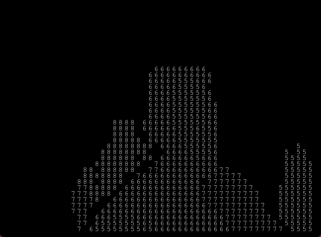

# Kinect Depth Image

This is a simple application that displays the distance of objects in an image using the Kinect. It uses the Kinect library to capture and process depth data, and then maps the data to a visual output where the distance of each object is displayed in numbers.




## Usage

To use this application, you need to have a Kinect device and connect it to your computer. Once you have installed the necessary drivers and libraries, you can run the program and it will display the depth image captured by the Kinect. The program will then convert the depth data to distance values and display them in the image.

## Benefits

The Kinect Depth Image application has several benefits, including:

- Accurate distance measurement: The Kinect uses infrared technology to accurately measure the distance of objects, making this application useful in fields such as robotics, computer vision, and virtual reality.

- Real-time processing: The program processes the depth data in real-time, allowing for quick and responsive feedback.

- Simple implementation: The code is straightforward and easy to understand, making it easy to modify and customize for specific use cases.

## Installation

To install this application, you need to have Processing installed on your computer. Once you have installed Processing, you can download the code and run it within the Processing environment.

## Code

The code for this application uses the Kinect library to capture and process the depth data. It then converts the raw depth values to distance values using a lookup table, and maps these values to the image output. The code also includes a threshold for the minimum and maximum depth values, allowing you to filter out unwanted data.


## Kinect v1 Requirements
- Kinect v1
- Kinect v1 power adapter for windows

####  Linux

Requirements?
```bash 
sudo apt-get install libusb-1.0-0 libusb-1.0-0-dev
```

#### Windows.

 - Use [Zadig](http://zadig.akeo.ie/) to install the libusbK driver for each device you wish to use. This includes installing the libusbK for all the kinect v1 drivers listed on Zadig GUI.
 - If you got the error message 'Isochronous transfer error: 1', you should try downgrade the libusbK using [Older Zadig Version](http://zadig.akeo.ie/downloads/zadig_2.0.1.exe)
